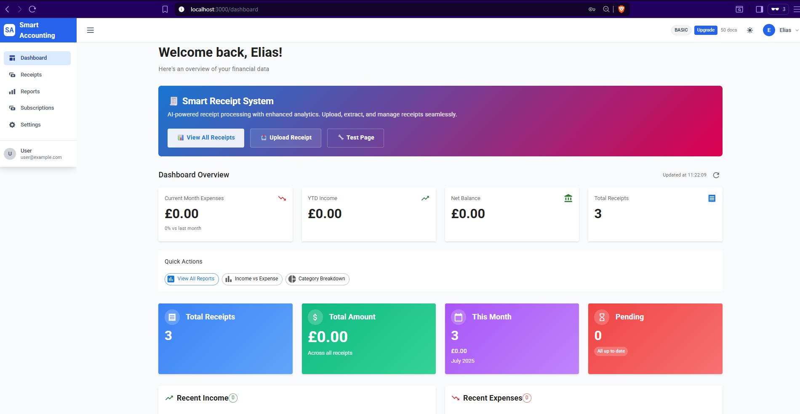
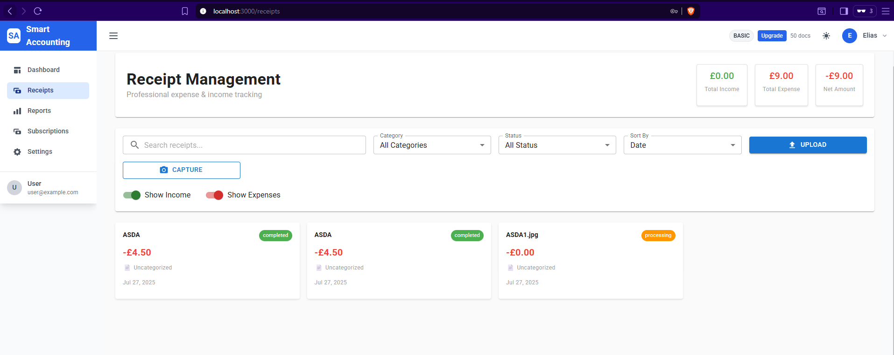
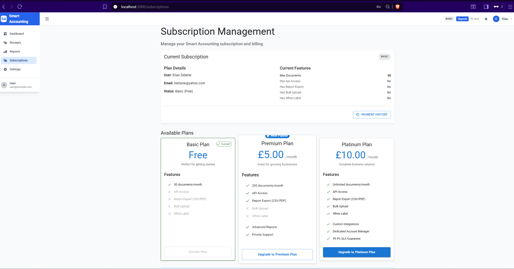
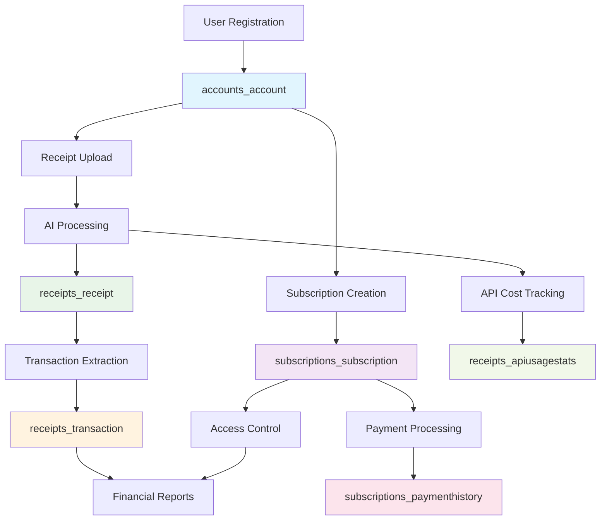

# 🧾 Smart Accounting – AI-Powered Receipt Management & Financial Insights

> **Transform your receipts into actionable financial insights** with **Smart Accounting**, a full-stack SaaS platform that automates receipt capture, categorization, and reporting using AI vision models.

---

## 📑 Table of Contents

1. [🚀 Overview](#-overview)
2. [📸 Screenshots](#-screenshots)
3. [🛠️ Tech Stack](#️-tech-stack)
4. [�️ Database Schema](#️-database-schema)
5. [�🔌 Key Features](#-key-features)
6. [📦 Installation](#-installation)
7. [🌐 Environment Variables](#-environment-variables)
8. [💻 Usage](#-usage)
9. [🧩 API Reference](#-api-reference)
10. [🧰 Development Setup](#-development-setup)
11. [🧪 Testing & Validation](#-testing--validation)
12. [🧑‍💻 Contributing](#️-contributing)
13. [📄 License](#-license)
14. [🌟 Acknowledgements](#-acknowledgements)

---

## 🚀 Overview

**Smart Accounting** is a production-grade financial SaaS application designed for individuals and small businesses to:

- ✅ **Upload receipts** via image or PDF
- ✅ **Extract structured data** using AI vision (OpenAI GPT-4o, XAI Grok)
- ✅ **Categorize expenses** automatically
- ✅ **Track income & expenses** with real-time dashboards
- ✅ **Generate financial reports** (CSV/PDF export)
- ✅ **Subscribe via Stripe** with tiered plans (Basic, Premium, Platinum)

Built with modern technologies and deployed on **Heroku**, it combines robust backend logic with a clean, responsive frontend.

---

## 📸 Screenshots

### Dashboard Overview
  
*Real-time financial summary and analytics*

### Receipt Upload & Processing
  
*Drag & drop upload with AI-powered OCR extraction*

### Financial Reports
  
*Category breakdown, tax-deductible tracking, and vendor analysis*

### Subscription Management
  
*Stripe-powered tiered access control*

---

## 🛠️ Tech Stack

| Layer | Technology |
|-------|------------|
| **Frontend** | React 18+, TypeScript, MUI, Chart.js |
| **Backend** | Django REST Framework (Python 3.11) |
| **Database** | PostgreSQL (Neon.tech) |
| **Authentication** | JWT with token refresh |
| **AI Vision APIs** | OpenAI |
| **Image Storage** | Cloudinary |
| **Payments** | Stripe Subscriptions (Test Mode) |
| **Deployment** | Heroku |
| **CI/CD** | GitHub Actions (Auto-deploy) |

---

## 🗄️ Database Schema

### Entity-Relationship Diagram (ERD)

  
*Smart Accounting Database Schema - Entity Relationship Diagram*

### Core Entities

#### 👤 **accounts_account Table (User Authentication)**
- **Database Table:** `accounts_account`
- **Primary Purpose:** User authentication and account management
- **Key Fields:** 
  - `id` (BigAutoField, Primary Key)
  - `username` (CharField, 150, Unique)
  - `email` (CharField, 254, Unique)
  - `first_name`, `last_name` (CharField, 150)
  - `phone_number` (CharField, 20, Nullable)
  - `company_name` (CharField, 255, Nullable)
  - `user_type` (CharField, 20)
  - `subscription_plan` (CharField, 20)
  - `stripe_customer_id`, `stripe_subscription_id` (CharField, 255, Nullable)
  - `subscription_status` (CharField, 50)
  - `address`, `city`, `postal_code`, `country` (CharField, Nullable)
- **Relationships:** One-to-Many with receipts_receipt, One-to-One with subscriptions_subscription

#### 🧾 **Receipt Table**
- **Primary Purpose:** Store uploaded receipts and AI-extracted data
- **Key Fields:** `id`, `owner` (FK), `cloudinary_url`, `original_filename`, `extracted_data`, `processing_metadata`
- **Relationships:** Many-to-One with User, One-to-One with Transaction
- **AI Integration:** Stores OCR results from OpenAI GPT-4o and XAI Grok APIs
- **Advanced Features:** Cloudinary integration, confidence scoring, manual verification

#### � **Transaction Table**
- **Primary Purpose:** Normalized transaction data extracted from receipts
- **Key Fields:** `id`, `receipt` (FK), `owner` (FK), `vendor_name`, `transaction_date`, `total_amount`, `category`
- **Relationships:** One-to-One with Receipt, Many-to-One with User
- **Categories:** Meals, Travel, Office Supplies, Utilities, Software, Hardware, Marketing, etc.
- **Features:** VAT tracking, line items, expense/income classification

#### �💳 **Subscription Table**
- **Primary Purpose:** Manage user subscription tiers and Stripe billing
- **Key Fields:** `id`, `user` (FK), `plan`, `stripe_subscription_id`, `status`, `max_documents`
- **Relationships:** One-to-One with User
- **Plans:** `basic` (50 docs), `premium` (200 docs), `platinum` (unlimited)
- **Features:** API access, report export, bulk upload permissions

#### 💸 **PaymentHistory Table**
- **Primary Purpose:** Track subscription payments and billing history
- **Key Fields:** `id`, `user` (FK), `stripe_invoice_id`, `amount_paid`, `status`, `payment_date`
- **Relationships:** Many-to-One with User
- **Integration:** Stripe invoice tracking, PDF receipts, payment status

#### 📊 **APIUsageStats Table**
- **Primary Purpose:** Monitor AI API costs and performance metrics
- **Key Fields:** `id`, `date`, `api_name`, `requests_count`, `total_cost_usd`, `total_tokens`
- **Features:** Daily aggregation, success/failure tracking, cost optimization

### Database Design Principles

✅ **Normalized Structure** - Third Normal Form (3NF) compliance  
✅ **Foreign Key Constraints** - Referential integrity maintained  
✅ **Indexed Fields** - Optimized for common queries (`user_id`, `date`, `category`)  
✅ **Scalable Design** - Ready for horizontal scaling with partition strategies  
✅ **Audit Trail** - Timestamps for creation and modification tracking  

### Data Flow Architecture



---

## 🔌 Key Features

### ✅ **AI-Powered Receipt Extraction**
- Uses **OpenAI GPT-4o** as primary model
- Falls back to **XAI Grok-2-vision-1212** on timeout
- Extracts:
  - Vendor, Date, Total, Tax, Currency
  - Itemized list and category predictions
  - Confidence score and processing cost

### ✅ **Modular Frontend Architecture**
- Feature-based folder structure:

```
smart-accounting/
├── backend/                          # Django Backend
│   ├── backend/                      # Project settings
│   │   ├── settings.py              # Django configuration
│   │   ├── urls.py                  # Main URL routing
│   │   └── wsgi.py                  # WSGI configuration
│   ├── receipts/                     # Receipts app
│   │   ├── models.py                # Receipt & Transaction models
│   │   ├── views.py                 # API ViewSets
│   │   ├── serializers.py           # DRF serializers
│   │   ├── urls.py                  # Receipt URLs
│   │   └── services/                # Business logic
│   │       └── enhanced_openai_service.py  # OCR processing
│   ├── accounts/                     # User management
│   ├── subscriptions/               # Stripe integration
│   ├── reports/                     # Financial reports
│   ├── requirements.txt             # Python dependencies
│   └── Procfile                     # Heroku process file
├── frontend/                         # React Frontend
│   ├── public/                      # Static assets
│   ├── src/                         # Source code
│   │   ├── components/              # React components
│   │   │   ├── receipts/           # Receipt components
│   │   │   ├── dashboard/          # Dashboard widgets
│   │   │   ├── subscriptions/      # Subscription components
│   │   │   └── common/             # Shared components
│   │   ├── pages/                   # Page components
│   │   │   ├── ProfessionalReceiptDashboard.jsx
│   │   │   ├── dashboard/DashboardPage.js
│   │   │   └── reports/ReportsPage.js
│   │   ├── services/                # API services
│   │   │   └── api/receiptService.js
│   │   ├── context/                 # React Context
│   │   │   ├── AuthContext.js      # Authentication
│   │   │   └── AppContext.js       # App state
│   │   ├── utils/                   # Utility functions
│   │   └── config/                  # Configuration
│   ├── package.json                 # Node dependencies
│   └── build.sh                     # Build script
├── docs/                            # Documentation
│   └── screenshots/                 # Application screenshots
├── README.md                        # This file
└── docker-compose.yml              # Docker setup
```

- Plug-and-play components with separation of concerns
- Dark/light mode support

### ✅ **Secure Authentication**
- JWT-based login/registration
- Email verification & password reset
- Token auto-refresh with interceptor
- Role-based access control

### ✅ **Real-Time Dashboard**
- Total receipts, amount, this month stats
- Categorized receipts widget
- Recent transactions & status indicators
- Responsive design (mobile-first)

### ✅ **Financial Reporting Engine**
- Monthly Income vs Expense
- Category Breakdown (Pie/Bar charts)
- Tax-Deductible Expense Report
- Vendor Spend Analysis
- Audit Log (with AI confidence tracking)
- Export to **CSV** and **PDF**

### ✅ **Stripe Subscription System**

| Tier | Price | Features |
|------|-------|----------|
| **Basic (Free)** | £0 | 10 receipts/day, basic dashboard |
| **Premium** | £5/month | Unlimited uploads, CSV export |
| **Platinum** | £10/month | All reports, PDF export, advanced analytics |

---

## 📦 Installation

### **Prerequisites**
- Python 3.12+
- Node.js 16+
- PostgreSQL 12+
- Git

### **1. Clone Repository**
```bash
git clone https://github.com/repoeli/smart-accounting.git
cd smart-accounting
```

### **2. Backend Setup**
```bash
cd backend

# Create virtual environment
python -m venv venv
source venv/bin/activate  # Windows: venv\Scripts\activate

# Install dependencies
pip install -r requirements.txt

# Environment configuration
cp .env.example .env
# Edit .env with your API keys

# Database setup
python manage.py migrate
python manage.py createsuperuser

# Start development server
python manage.py runserver
```

### **3. Frontend Setup**
```bash
cd frontend

# Install dependencies
npm install

# Environment configuration
cp .env.example .env
# Edit .env with API URLs

# Start development server
npm start
```

---

## 🌐 Environment Variables

### Backend (`.env`)
```env
# Django
DEBUG=False
SECRET_KEY=your_django_secret_key
ALLOWED_HOSTS=smart-backend.herokuapp.com
DATABASE_URL=postgres://...
REDIS_URL=rediss://...

# AI APIs
OPENAI_API_KEY=sk-...
XAI_API_KEY=xai-...

# Cloudinary
CLOUDINARY_URL=cloudinary://...

# Stripe
STRIPE_TEST_SECRET_KEY=sk_test_...
STRIPE_WEBHOOK_SECRET=whsec_...
```

### Frontend (`.env`)
```env
# Production
REACT_APP_API_URL=https://smart-backend.herokuapp.com

# Local Development
REACT_APP_API_URL=http://localhost:8000/api/v1
```

---

## 💻 Usage

### 1. Receipt Upload & Processing

```javascript
// Upload receipt via API
const formData = new FormData();
formData.append('image', receiptFile);
formData.append('description', 'Business lunch');

const response = await fetch('/api/v1/receipts/', {
  method: 'POST',
  headers: {
    'Authorization': `Bearer ${token}`
  },
  body: formData
});
```

### 2. Extracted Data Format

```json
{
  "id": 123,
  "extracted_data": {
    "vendor": "ASDA Supermarket",
    "total": 45.67,
    "tax": 7.61,
    "date": "2024-01-15",
    "currency": "GBP",
    "type": "expense",
    "line_items": [
      {"description": "Groceries", "amount": 38.06}
    ]
  },
  "processing_metadata": {
    "processing_time": 2.3,
    "cost_usd": 0.0035,
    "confidence_score": 0.95
  },
  "cloudinary_url": "https://res.cloudinary.com/...",
  "ocr_status": "completed"
}
```

---

## 🧩 API Reference

**Swagger Documentation:** [https://smart-backend.herokuapp.com/swagger](https://smart-backend.herokuapp.com/swagger)

### 🔐 Authentication

| Endpoint | Method | Description |
|----------|--------|-------------|
| `/api/v1/accounts/register/` | POST | Register new user |
| `/api/v1/accounts/token/` | POST | Get JWT access/refresh tokens |
| `/api/v1/accounts/me/` | GET | Get current user profile |

### 📎 Receipts

| Endpoint | Method | Description |
|----------|--------|-------------|
| `/api/v1/receipts/` | POST | Upload receipt image/PDF |
| `/api/v1/receipts/{id}/` | GET | Get receipt details |
| `/api/v1/receipts/analytics/` | GET | Dashboard summary stats |

### 📊 Reports

| Endpoint | Method | Description |
|----------|--------|-------------|
| `/api/v1/reports/income-expense/` | GET | Monthly income vs expense |
| `/api/v1/reports/category-breakdown/` | GET | Spending by category |
| `/api/v1/reports/tax-deductible/` | GET | Business expense report |

### 💳 Subscriptions

| Endpoint | Method | Description |
|----------|--------|-------------|
| `/api/v1/subscriptions/create-checkout-session/` | POST | Create Stripe Checkout session |
| `/api/v1/subscriptions/billing-portal/` | GET | Redirect to Stripe customer portal |

---

## 🧰 Development Setup

Live Demo: https://smart-frontend-production.herokuapp.com ✅

### 1. Clone the Repository
```bash
git clone https://github.com/yourusername/smart-accounting.git 
cd smart-accounting
```

### 2. Install Dependencies
```bash
# Backend
cd backend
pip install -r requirements.txt

# Frontend
cd ../frontend
npm install
```

### 3. Set Up Environment
Create `.env` files in both `backend/` and `frontend/`.

### 4. Run Locally
```bash
# Start Docker services
docker-compose up

# Or run separately
# Backend
python manage.py runserver

# Frontend
npm start
```

---

## 🧪 Testing & Validation

✅ Local Testing Scripts available in the repository

---

## 🧑‍💻 Contributing

We welcome contributions! Please follow these steps:

1. Fork the project
2. Create your feature branch (`git checkout -b feature/AmazingFeature`)
3. Commit your changes (`git commit -m 'Add some AmazingFeature'`)
4. Push to the branch (`git push origin feature/AmazingFeature`)
5. Open a Pull Request

---

## 📄 License

This project is licensed under a Proprietary License.  
For licensing inquiries, contact ineliyow@yahoo.com

---

## 🌟 Acknowledgements

### Educational Support
- **WAES Westminster Adult Education Service** - For providing us 4-month Full Stack Developer Bootcamp
- **Code Institute** - For providing us well-structured and organized Full Stack Intensive course

### Mentorship Team
- **Our Tutor Munawar Nadeem** - For valuable guidance
- **Sathish Boini, and Stephen Owen** - For valuable and practical implementations of Cyber Security best practices on Web Application (SaaS)
- **Clara Beckley** - Giving us the best insight on job hunting techniques and industry standard engagement techniques

### Technology Partners
- **OpenAI** – For GPT-4 Vision API
- **XAI (xAI)** – For Grok Vision API
- **Stripe** – For seamless subscription management
- **Neon.tech** – For serverless PostgreSQL
- **Cloudinary** – For media storage
- **Heroku** – For reliable PaaS

---

**Smart Accounting – Turn receipts into revenue insights.**  
© 2025 Smart Accounting. All rights reserved.